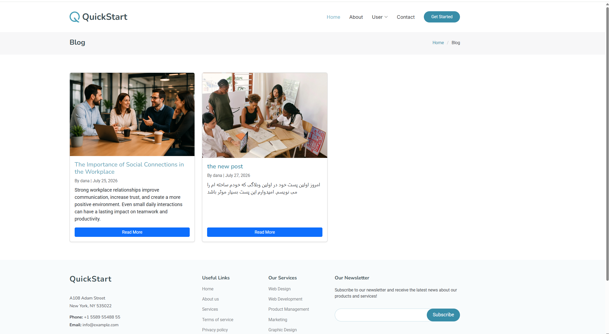
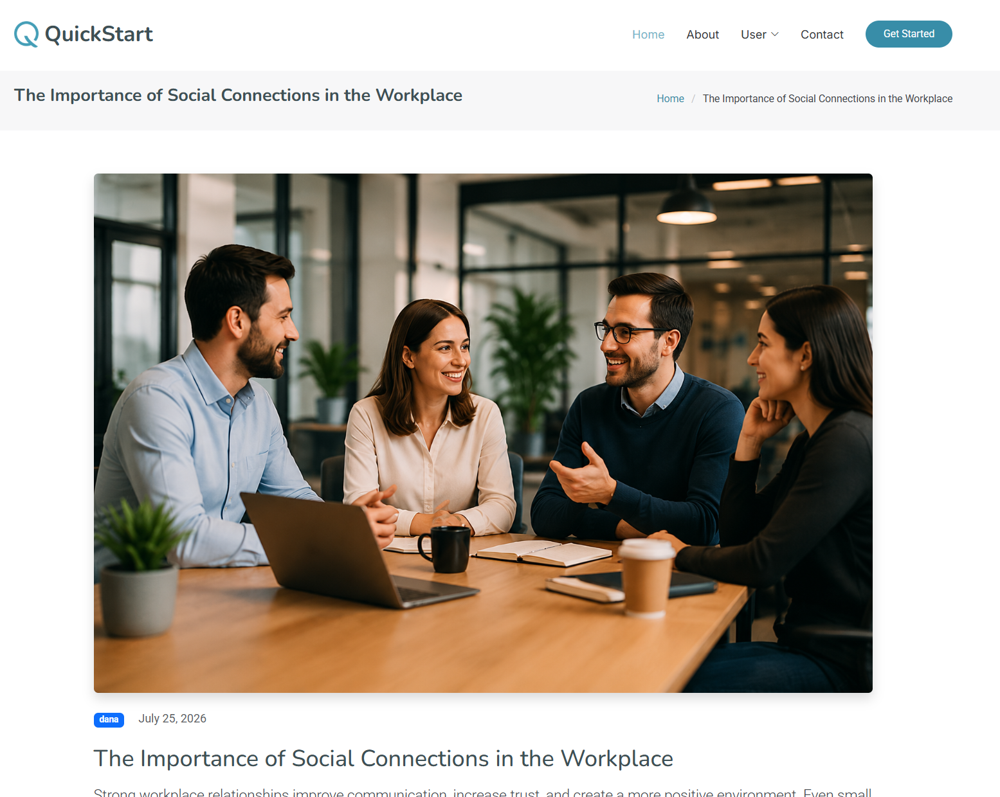
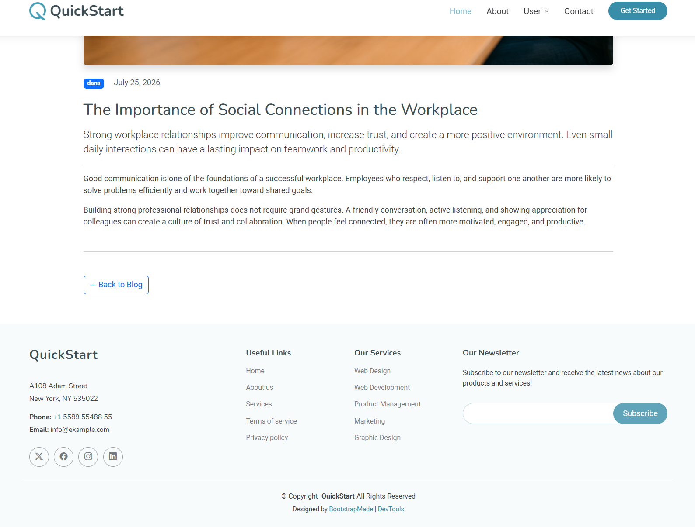

# Modern Django Blog

A modern blog application built with Django and Bootstrap 5.

## Features

- User authentication
- User registration and login
- Create blog posts
- Blog listing page
- Blog detail page
- Image upload for posts
- Responsive design using Bootstrap 5

## Screenshots

### Home Page

### Blog Page

### Post Detail

## Technologies

- Python
- Django 6
- Bootstrap 5
- SQLite
- HTML/CSS

## Project Structure
